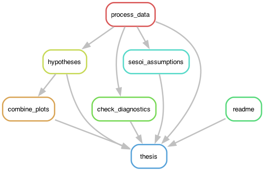

# Assessing Publication Bias in Meta-Analyses
Jan Luca Schnatz

## Project Structure

`R/`: contains all R-scripts for data analysis and visualization

    #> R/
    #> ├── check_convergence.R
    #> ├── check_validity.R
    #> ├── combine_plots.R
    #> ├── dispersion.R
    #> ├── distributions.R
    #> ├── functions.R
    #> ├── h1.R
    #> ├── h2.R
    #> ├── h3.R
    #> ├── h4.R
    #> └── process_data.R

The `R/functions.R` files contains all custom R-functions that are
defined for the project. The file h\_\*(1-4).R containts the analysis of
the four hypotheses. The `R/combine_plots.R` file combines all plots
generated for each hypothesis into one large multi-panel figure. The
`R/07_check_validity.R` script containts diagnostic code to assess the
problems within the parameter estimation of SPEEC. The
`R/08_check_convergence.R` file contains a shiny app to assess the
parameter convergence for each study. Finally `R/09_dispersion.R`
contains code to analyse the overall dispersion of the estimated
publication bias parameter.

`data/`: Data files

    #> data/
    #> ├── meta
    #> │   ├── processed
    #> │   └── raw
    #> ├── optim
    #> │   ├── processed
    #> │   └── raw
    #> └── src

The data is generally structured into three subdirectories (meta, optim,
src). The `meta` directory contains all data regarding the raw and
processed meta-analytical data. The `optim` directory contains all data
related to the parameter optimization (raw, and processed). Finally, the
`src` folder contains additional data that is needed within the Quarto
file to compile the thesis.

`scripts/`: Quarto scripts that are compiled into a reproducible report

    #> scripts/
    #> ├── 0_main.qmd
    #> ├── 1_introduction.qmd
    #> ├── 2_methods.qmd
    #> ├── 3_results.qmd
    #> ├── 4_discussion.qmd
    #> ├── 5_references.qmd
    #> └── 6_appendix.qmd

## Reproducability

First, if not already installed, download `git`
(https://git-scm.com/downloads). Then clone this repository from GitHub:

``` bash

cd to/your/directory
git clone https://github.com/jlschnatz/bachelor-thesis.git 
# or
git clone git@github.com:jlschnatz/bachelor-thesis.git 
```

Next, you need to install Docker (Docker version 24.0.6, build ed223bc).
To build the Dockerfile for this project dynamically run:

``` bash

bash ./build_dockerfile.sh 
```

To build the Docker image from the created Dockerfile, run:

``` bash

bash ./virtualize.sh
```

Now that you have build to image, you can start a container with a bash
entry point to interactively explore the container and run the pipeline:

``` bash

sudo docker run -it --rm --entrypoint bash schnatz/thesis
```



# License

Shield: [](http://creativecommons.org/licenses/by-sa/4.0/)

This work is licensed under a [Creative Commons Attribution-ShareAlike
4.0 International
License](http://creativecommons.org/licenses/by-sa/4.0/).

[](http://creativecommons.org/licenses/by-sa/4.0/)
